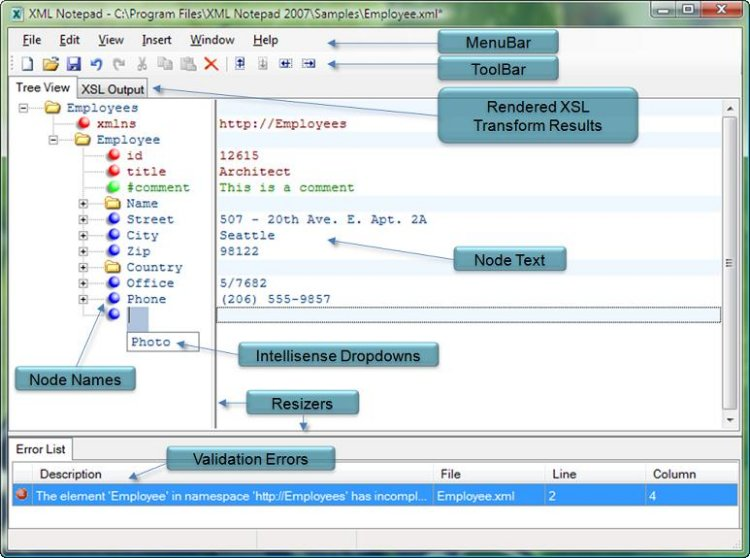
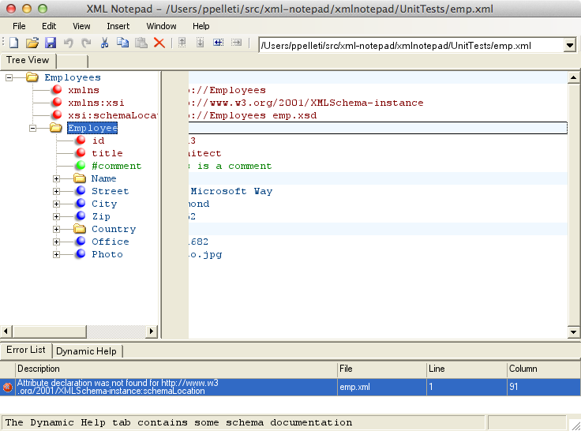

XML Notepad for Mono
====================

This is an attempt to port Microsoft's
[XML Notepad](http://xmlnotepad.codeplex.com/) to build and run on
[Mono](http://www.mono-project.com/).  (Specifically, I am using Mono
3.10 on Mac OS X "Mavericks" 10.9.  And since it appears that in the
official relase of 3.10, WinForms doesn't work at all on OS X, it's
necessary to install
[this unofficial version of 3.10](http://forums.xamarin.com/discussion/27011/fix-for-gdipcreatefromcontext-macosx-and-other-macios-gdi-issues)
instead.)

To build XML Notepad, just run the `build.sh` script in the top-level
directory.  It should build with a ton of warnings, but no errors.
The resulting executable should appear in
`xmlnotepad/drop/XmlNotepad.exe`, and therefore can be run with
`mono xmlnotepad/drop/XmlNotepad.exe`.  The name of an XML file to
edit can optionally be given as an argument.

I have been successful in that XML Notepad now builds on Mono, and it
does start up and run a bit.  However, it is so buggy that it is
**not usable** in its current form.  Therefore, the main value of my
work is:

1. To serve as a starting point for further work in porting XML
   Notepad to Mono.

2. To answer the question, "Why can't XML Notepad be used on Mono?"

In particular, some of the current issues are:

* The WebBrowser control is used for a fair amount of XML Notepad's
  functionality, and I had to rip it all out, because although there's
  some mention of a Gecko-based WebBrowser control for Mono, it's
  unclear how to obtain it, or whether it's currently being maintained
  and is usable.  In particular, it appears that the WebBrowser control
  [is not supported on OS X at all](http://stackoverflow.com/questions/468906/how-to-instal-libgluezilla-for-mac-os-x).
  Perhaps the best way to restore the missing functionality would be
  to launch an external web browser instead.

* I had to remove the unit tests, because they used
  `Microsoft.VisualStudio.TestTools.UnitTesting`, which is not
  available on Mono.  Ideally, it would be nice to port the unit tests
  to use [NUnit](http://www.nunit.org/).

* There's some sort of refresh problem in the "node text" area,
  because a portion of it on the left is not initially rendered.
  However, it can be made visible by clicking on the "node text" area.
  
  It should look like this:
  
  
  
  But it looks like this:
  
  

* `Edit > Incremental Search` doesn't appear to work at all.

* `Edit > Find...` works correctly (apart from refresh issues) as long
  as there is another occurrence, but clicking "Find Next" when there
  isn't another occurrence results in a hang, and eventually a stack
  overflow.

* This repo currently builds *only* on Mono, because I have hacked it
  to death.  Ideally, it would be nice to be able to build the
  original XML Notepad and the Mono XML Notepad from the same
  codebase.  (Then there might be a chance of getting it accepted
  upstream.)

Pull requests to fix these issues (or any others) would be very
welcome.
